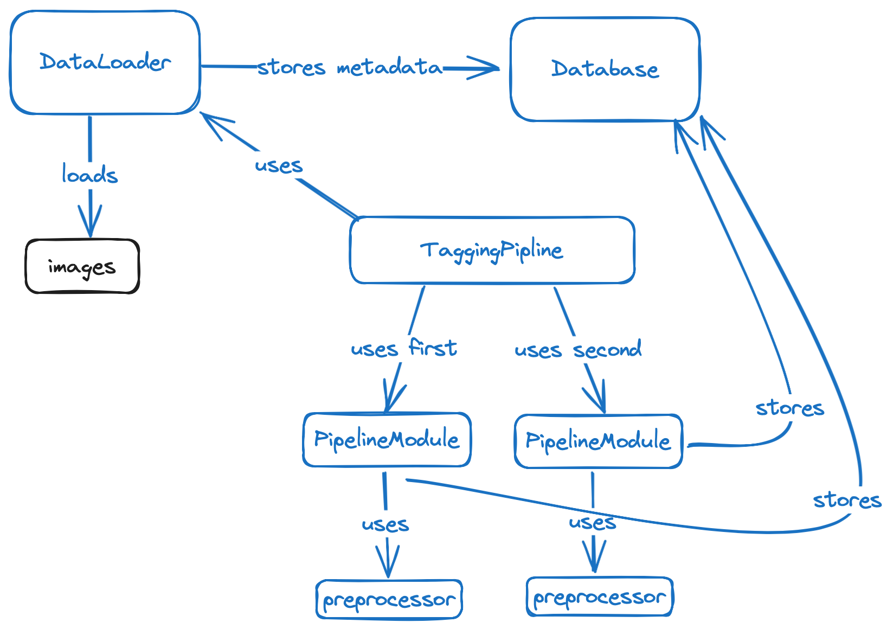

# Pixel Brain

Pixel Brain is a project that uses machine learning models to easily and automatically process and classify images.  
It includes modules for image classification with models such as ResNet, image processing with GPT-4 Vision, preprocessing modules for different modules, and a database for storing and retrieving processed data.  
All the modules are composable and extendable.

## High level design

## Modules

### Preprocessor

This is an interface for preprocessing a batch of images for a certain model. It is an abstract base class and needs to be subclassed for specific preprocessing methods.

### DataLoader

The DataLoader class loads and decodes images either from disk or S3. It can be configured to load images in batches and optionally decode the images.

### Database

The Database class is used to interact with the MongoDB database. It can store fields, query vector fields, find images, and perform other database operations.

### ResnetClassifierModule

This module classifies images into one of the ImageNet classes and stores the class in a database. It can receive a list of classes to choose from (a subset of ImageNet classes), out of which it will pick the one with the largest probability.

### Gpt4VModule

This module processes images with GPT-4 Vision and stores the results in a database. It can ask a question to GPT-4 Vision and store the results in a specified field in the database.

## Usage

To use these modules, you need to create instances of them and then call their methods. For example, to classify an image using ResNet, you would create an instance of ResnetClassifierModule, and then call its `process` method.

For more detailed usage instructions, please refer to the source code of each module.

